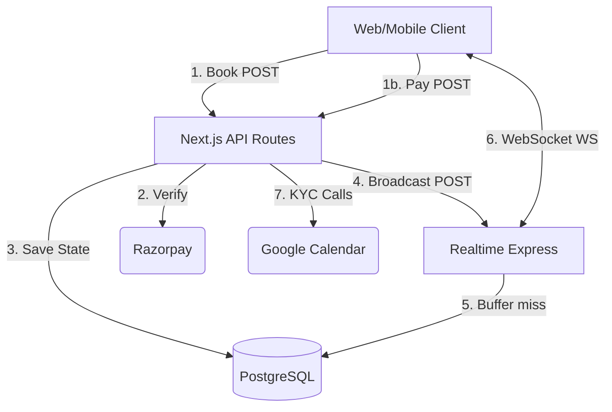

# API Architecture Deep Dive

This document provides a comprehensive structural mapping and analysis of the APIs operating across the Helper Platform monorepo.

---

## 1. Comprehensive Endpoint Analysis (`apps/web` & `apps/realtime`)

### Auth & System Access
**`ALL /api/auth/[...all]`** (Next.js)
- **Purpose**: Unified credential and OAuth session issuance.
- **Auth Required**: No (for login), Yes (for profile edits).
- **Interactions**: Next.js -> better-auth -> `user` / `session` tables.
- **Security/Risks**: Rate limiting relies on `better-auth`. Password bruting mitigated by default.
- **Performance**: High (Edge-bound cryptographic checks).

**`GET /api/realtime/ws-token`** (Next.js)
- **Purpose**: Issues a short-lived token to upgrade WebSockets.
- **Auth Required**: Yes (`user` session).
- **Payload**: None.
- **Response**: `{ wsToken: "jwt-string" }`
- **Interactions**: Derives new token using `REALTIME_WS_AUTH_SECRET`.
- **Risks**: Token leakage could allow unauthorized socket listens. 

### Bookings (Core Marketplace)
**`POST /api/bookings`** (Next.js)
- **Purpose**: Creates a new booking and triggers dispatch targeting.
- **Auth Required**: Yes (Customer).
- **Request Structure**: `{ categoryId: string, address: object, latitude: number, longitude: number, ...}`
- **Database**: `INSERT` into `booking`, `booking_candidate`, `booking_status_event`.
- **External**: Calls internal `POST /api/realtime/broadcast`.
- **Validation**: Strict Zod boundary on payload. 
- **Risks**: High DB load resolving `candidate` matches over raw geometry.

**`POST /api/bookings/[id]/[action]`** (Next.js)
*(Actions: accept, reject, start, complete, cancel)*
- **Purpose**: Transitions a booking's lifecycle machine.
- **Auth Required**: Yes (Helper or Customer context mapping).
- **Database**: `UPDATE booking`, `INSERT booking_status_event`.
- **Validation**: Checks `status` hierarchy bounds (e.g. Cannot `start` an un-`accepted` job).
- **Risks**: High potential for double-accept concurrency lock failures without `FOR UPDATE` db logic.

**`GET /api/bookings/[id]`** (Next.js)
- **Purpose**: Retrieve job details.
- **Auth Required**: Yes.
- **Database**: Deep joins fetching `booking` with `payment_transaction` and `helper_profile`.

### Payments & Tracking
**`POST /api/payments`** (Next.js)
- **Purpose**: Generates dynamic checkout order blocks.
- **Auth Required**: Yes (Customer).
- **External**: API call to Razorpay (Orders endpoint).
- **Database**: `INSERT payment_transaction`.

**`POST /api/payments/verify`** (Next.js)
- **Purpose**: Completes checkout loop capturing the client-side returned payload.
- **Auth Required**: Yes.
- **Validation**: Computes `HMAC(SHA256)` against payload comparing to Razorpay callback signature.
- **Risks**: Signature logic skip could grant free jobs.

**`POST /api/payments/webhook`** (Next.js)
- **Purpose**: Async out-of-band capture tracking from Razorpay.
- **Auth Required**: No (validates network signature from provider).
- **Performance Risks**: Webhook bursts could exhaust serverless DB pool limits returning HTTP 504 to Razorpay.

### Helper Onboarding & Verifications
**`POST /api/helpers/onboarding`** (Next.js)
- **Purpose**: Inserts physical metadata.
- **Database**: Upserts `helper_profile`.

**`POST /api/cloudinary/sign`** (Next.js)
- **Purpose**: Returns signature timestamp offloading base64 bandwidth limits directly toward Cloudinary CDN.
- **Auth Required**: Yes.
- **Risks**: Unrestricted file size/extension mapping if not filtered strictly on Cloudinary policies.

**`POST /api/verifications/video-kyc/schedule`** (Next.js)
- **Purpose**: Assigns Google Meet slot.
- **External**: Google Service Account / Calendar API.
- **Database**: `INSERT video_kyc_session`.

### Realtime Operational API (Node.js/Express)
**`POST /api/realtime/broadcast`** (Express)
- **Purpose**: Pushes a socket event frame.
- **Auth Required**: Internal Secret `REALTIME_BROADCAST_SECRET`.
- **Payload**: `{ targets: [{ userId, payload }] }`.
- **Logic**: Reads internal `WsDispatcher` tree. Emits immediately or falls back `INSERT notification_queue` on miss.
- **Risks**: Single Point of Failure (SPOF); operates in-memory avoiding cross-node boundaries.

---

## 2. API Dependency Graph

---

## 3. High-Level Metrics & Critical Mapping

### Most Critical APIs
1. **`POST /api/bookings`**: The revenue engine. If this fails, matching stops.
2. **`POST /api/realtime/broadcast`**: Without this internal hook, helpers remain blind to new requests unless actively refreshing.
3. **`POST /api/payments/verify`**: Validates the cryptographic trust bounding service execution.

### Slowest APIs (Expected Profiling)
1. **`POST /api/bookings`**: Resolving available helpers mathematically against radii maps requires heavy execution delays prior to target insertions.
2. **`POST /api/verifications/video-kyc/schedule`**: Serial blocking calls towards an external Oauth2 target (Google Calendar) inject massive network latency bounds.

### Most Scalable APIs
1. **`ALL /api/auth/[...all]`**: Heavily evaluated on Vercel Edge compute structures via fast crypto limits bypassing dense table scans.
2. **`/api/cloudinary/sign`**: Standard mathematical timestamping; moves the heavy physical file streaming entirely onto Cloudinary bypassing Next.js limits.

---

## 4. Suggested Refactoring & Optimization 

1. **Move Webhooks to Specialized Functions**:
   Move `POST /api/payments/webhook` out of the dense user-facing Next.js monolith onto a separate lambda function connected to an SQS/Message Broker. Current webhook structures are easily blocked by db contention causing payment retries.
2. **Batch Polling / WebSocket Fallback Strategy**:
   The `POST /api/realtime/broadcast` path is intentionally in-process today. If cross-instance fanout becomes a requirement, Redis or another backplane should be introduced explicitly instead of being implied by deleted scaffolding. Additionally, pushing notifications still needs a more formal Web Push fallback for targets that are not connected.
3. **Optimistic Payload Returns**: 
   Standardize UI returns across `/api/bookings/*`. Modifying a status `accept` should immediately return the hydrated object so Next.js doesn't run sequential `GET /api/bookings/[id]` lookups re-taxing the pool.