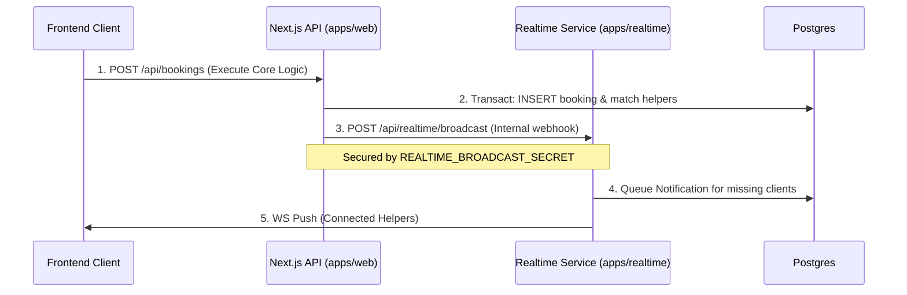

# Comprehensive System Architecture

This document provides a deep-dive reverse engineering of the Helper Platform's technical architecture, component communications, and system boundaries.

---

## 1. Frontend Architecture Map

- **Framework**: Next.js 16 (App Router), React 19
- **Structure**: 
  - **Server Components (RSC)**: Handles primary layout mapping, server-side data fetching directly from DB models, and SEO metadata logic.
  - **Client Components**: Forms, interactive UI (`packages/ui`), stateful dashboards (`useContext`, `useState`), and the global WebSocket client provider.
  - **Styling**: TailwindCSS driven through `shadcn/ui` localized components.
- **Portals**:
  - `/(customer)/*`: Customer requesting booking.
  - `/(helper)/*`: Service provider tracking jobs.
  - `/admin/*`: Back-office tracking and verifications.

## 2. Backend Architecture Map

The backend is deliberately bifurcated to respect serverless execution boundaries vs. persistent stream requirements:

1. **`apps/web` (Serverless HTTP Backend)**:
   - Next.js API Routes (`/app/api/*`) handles core business CRUD operations.
   - Operates in transient lambda cold/warm start containers (Vercel deployment target).
   - Owns webhooks (Razorpay) and cron proxying logic.
2. **`apps/realtime` (Stateful WebSocket Backend)**:
   - Node.js + Express 5 container. Always-on infrastructure.
   - Owns L4 persistent TCP socket connections (`ws`).
  - Acts as a microservice receiving inner-cluster communications via `/api/realtime/broadcast` and routing them through the in-memory dispatcher.

## 3. API Interaction Diagram



## 4. Database Relationship Map

```mermaid
erDiagram
    user ||--o1 helper_profile : has
    user ||--o{ booking : creates
    helper_profile ||--o{ booking_candidate : evaluated_for
    booking ||--o{ booking_candidate : includes
    booking ||--o{ booking_status_event : tracks_state
    booking ||--o{ payment_transaction : triggers
    booking ||--o1 review : receives
    booking ||--o1 dispute : causes
```

## 5. Authentication Flow

- **Strategy**: Hybrid Cookie-based Session + Dedicated Token issuance for WebSockets.
- **Core Lib**: `better-auth` handling `/api/auth/[...all]`.
- **Browser/HTTP**: Standard Next.js server actions validate the secure, http-only session cookie (JWE).
- **Socket Upgrades**: Native WS cannot pass cross-domain custom headers securely in browser environments easily.
  - *Mitigation*: Client hits `GET /api/realtime/ws-token` -> passing Next.js Session -> Server mints a short-lived scoped JWT.
  - *Connect*: Client opens `wss://...` passing `?token=` parameter which `apps/realtime` validates against `REALTIME_WS_AUTH_SECRET`.

## 6. State Management Flow

- **Server State**: Managed natively by Next.js App Router (RSC fetch requests, cache revalidation).
- **Client State**: Minimal layout states run on standard React hooks (`useState`).
- **Live Stream State**: Remote data injected directly into UI via Context Providers listening to WebSocket payloads, patching optimistic UI changes immediately over cached Next.js layouts.

## 7. Request Lifecycle

1. **Browser Request**: DNS -> CDN (Vercel Edge Network).
2. **Serverless Lambda (`web`)**: Next.js route handler spins up, validates user session.
3. **Database Execution**: `drizzle-orm` maps query to PostgreSQL.
4. **Side-Effect Orchestration**: If real-time action, Next.js fires an async `fetch()` ping towards `apps/realtime`.
5. **Response Frame**: UI returns success map, background `apps/realtime` handles delivery guarantees concurrently.

## 8. Deployment Pipeline

- **Monorepo Manager**: `Turborepo` dictates topological build order (e.g. build `packages/db` and `packages/ui` before building `apps/web` or `apps/realtime`).
- **Web App**: Targeted for Serverless (e.g., Vercel) executing via `npm run build` triggering Next.js static traces.
- **Realtime App**: Targeted for Long-Running Environments (e.g., Dockerfile -> AWS ECS / Render / Railway) executing a standard Node payload mapping against exposed port `8080/4000`.

## 9. Caching Strategy

- **Next.js Route Cache**: Public pages (marketing/landing) aggressively cached at the edge.
- **Data Cache (Fetch)**: Dynamic user dashboards bypass Next.js static caching forcing DB reads.
- **Client Cache (Router)**: Handled by React 19 navigating between Next.js layouts.
- **Database Caching**: No separate read-replica or Memcached caching applied to direct relational reads currently (relying purely on Postgres internal buffers).

## 10. Real-time Communication Architecture

- Uses `ws` library natively in `apps/realtime`.
- In-process mapping: `Map<UserId, WebSocket[]>` inside `WsDispatcher.ts` routes messages directly based on active handles.
- **Resilience**: The DB table `notification_queue` acts as the buffer for missed deliveries. The current implementation keeps fanout in-process, so multi-instance delivery still needs an explicit backplane design before it can be treated as horizontally scalable.

## 11. AI Request Pipeline

- No pipeline functionally present directly handling request mapping today.
- `package.json` notes AI-capable libraries representing future groundwork, but no direct inference flows (OpenAI/Anthropic APIs) are currently bound restricting architectural tracking.

---

## System Dynamics & Explanations

### How components communicate
- Internal packages (`packages/ui`, `packages/db`) are symlinked via `pnpm-workspace.yaml`. Code statically imports compiled dependencies.
- Infrastructure processes (`apps/web` to `apps/realtime`) communicate actively via internal HTTP REST payloads secured with a pre-shared secret. 

### How data moves
- Strongly typed payloads dictate standard movement. A Zod validator acts on external data entering an API. Drizzle ORM ensures types align hitting PostgreSQL. Web Socket events duplicate these shapes broadcasting out to the client network directly.

### Tightly Coupled Modules
- `apps/web` is strictly tangled to `packages/db`. If the database migrations shift, the API structures fail instantly natively.
- Next.js Auth bindings (`better-auth`) are securely tied into Next.js middleware execution limits stopping standard node migration.

### Reusable Modules
- **`packages/ui`**: Highly agnostic React component payload (shadcn wrapped) completely portable to another framework.
- **`packages/validators`**: Contains payload bounds capable of porting dynamically anywhere across the repo validating inputs identical between frontwards API calls and Socket broadcasts.

### Scaling Bottlenecks
- **In-Memory WebSockets**: Distributing `apps/realtime` into multi-instance auto-scaling groups still fails out of the box because Node A cannot push connection broadcasts to Node B's active handles without a separate backplane.
- **Thundering Reconnects**: If the WS server recycles, reconnecting clients collectively querying `notification_queue` directly onto the Master Postgres node will lock CPU thresholds instantly.

---

## Architectural Patterns Identified

| Pattern | Presence & Location | Description |
| :--- | :--- | :--- |
| **Monolithic Codebase** | Yes | Organized tightly as a `Turborepo` structure enforcing combined boundaries. |
| **Microservice-Ready** | Yes | `apps/realtime` behaves as an operational microservice decoupling stream processing. |
| **Serverless Functions** | Yes | `apps/web/src/app/api` completely operates via FaaS lambdas environments. |
| **Edge Functions** | Partial | Next.js middleware evaluating `better-auth` operates mostly around Edge evaluating cookies. |
| **Middleware Usage** | Yes | Express `socket` verifiers, Next.js routing guards protecting Admin bounds. |
| **Queue/Background Jobs**| Simulated | Relies on reconnect polling onto standard relational tables rather than distinct asynchronous brokers (e.g. no Redis/RabbitMQ/Kafka pipeline natively running job bounds today). |
