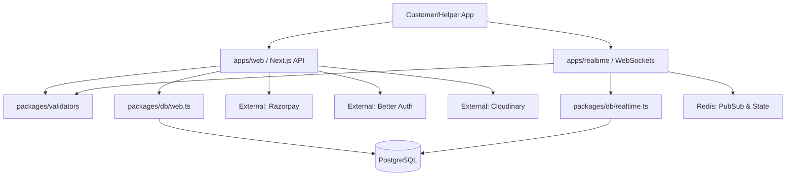

# Master Knowledge Graph & Mental Model

**Target Platform:** Helper Platform
**Purpose:** Provide a complete holistic mapping of the entire startup's technical and operational footprint.

---

## 1. The Mental Model (How to Think About This System)

Think of the Helper Platform not as a single app, but as a biological organism:
- **The Brain (`apps/web`):** Serverless Next.js. Handles slow, deliberate thoughts—UI rendering, authentication, payments, creating bookings. It is stateless and spins up/down constantly.
- **The Nervous System (`apps/realtime`):** Stateful Node.js WebSocket Server. Fast, twitch-response actions. Live GPS tracking, instant chat messaging, and push notifications.
- **The Memory (`packages/db` / Postgres):** Long-term, permanent storage. Bookings, User Profiles, Financial Ledgers.
- **The Reflexes (Redis):** Short-term, volatile memory. Active WS connection IDs, rapid location pings, rate limiting.
- **The Veins (Turborepo + Packages):** Shared code (`packages/ui`, `types`, `validators`) that circulates throughout the entire system ensuring consistency.

---

## 2. Master System & Module Topology

### All Systems & Environments
1. **Core Web App:** Next.js 15/16 + React 19 (Serverless via Vercel).
2. **Core Socket Server:** Express + Node.js WebSockets (Persistent via Railway/Render).
3. **Database:** PostgreSQL (Neon / AWS RDS / Supabase).
4. **Cache/PubSub:** Redis (Upstash / ElastiCache).
5. **CDN/Media:** Cloudinary (Static assets, profile pics).
6. **Payment Gateway:** Razorpay.

### All Modules (Monorepo Packages)
- `apps/web`: Frontend UI and standard REST/Server Actions.
- `apps/realtime`: Socket, Chat, and Location management.
- `packages/db`: Drizzle ORM schemas, clients, and migrations.
- `packages/ui`: Shadcn/ui component library.
- `packages/validators`: Zod schemas (API boundaries, DB inserts, Forms).
- `packages/types`: Shared TypeScript definitions.
- `packages/eslint-config` & `packages/typescript-config`: Tooling rules.

---

## 3. Dependency & API Graph

### All Major APIs
- **Next.js Endpoints:** `/api/auth/*` (Better-Auth), Webhook listeners (Razorpay, KYC), `/api/proxy` / Server Actions for DB mutators.
- **WebSocket Events:** `location:update`, `chat:send`, `booking:status_change`, `auth:handshake`.

---

## 4. Entity & Business Mapping

### All Database Entities (Root Level)
1. **Identities:** `users`, `helpers` (plus KYC metadata, video links).
2. **Transactions:** `bookings` / `jobs`, `payments`, `payouts`.
3. **Interactions:** `messages` (chat history), `reviews` / `ratings`.
4. **System:** `sessions`, `accounts` (Better Auth primitives), `push_subscriptions`.

### All User Flows
1. **Onboarding Flow:** Signup -> Otp/Magic Link -> Role Selection.
2. **Helper KYC Flow:** Submit details -> Video Upload -> Admin Approval -> "Active" Status.
3. **Core Booking Flow:** Customer searches -> Selects Helper -> Razorpay Auth/Hold -> Booking Created -> Socket Dispatch to Helper.
4. **Fulfillment Flow:** Helper accepts -> Live location syncs -> Helper arrives -> Job completed -> Payout triggered.

### All Business Flows
1. **Matching Engine:** Filter queries based on service category and rough geo-bounds.
2. **Escrow/Money Movement:** Customer pays -> Funds held -> Job complete -> Razorpay Route account transfer minus Platform Fee.
3. **Dispute Resolution:** Flagged jobs pause payout until Admin reviews chat logs and GPS history.

### All AI Flows (Targeted)
1. **Semantic Search:** Users type "My pipe is leaking" -> pgvector translates to `plumber` category.
2. **Automated Triage:** AI scans chat transcripts of flagged jobs to auto-summarize disputes for admins.

### All Deployment & Security Flows
- **Deployment:** Push to `main` -> GitHub Actions/TurboCache -> Vercel (Web) & Docker Build (Realtime) -> Drizzle migration triggers.
- **Security Layers:** 
  1. Next.js Middleware (Session validation).
  2. Zod parsing (Input sanitization).
  3. WebSocket Handshake (Token validation before establishing socket).
  4. Database RLS/Access scoping (ensuring users only fetch their own data).

---

## 5. Critical System Paths & Failure Points

| Critical Path | Mechanism | Primary Failure Point |
| :--- | :--- | :--- |
| **Booking Creation** | Web hits DB, holds Razorpay intent, triggers Realtime push. | DB row lock timeouts or Razorpay API outage. |
| **Location Tracking** | Phone emits coords -> Realtime node -> Redis -> Customer Phone. | Node.js connection exhaustion causing socket drops. |
| **Webhook Processing** | Razorpay POSTs to Web -> Verifies signature -> Updates DB state. | Lack of async queue (currently). High traffic causes Vercel to timeout, missing the payment confirmation. |
| **Monorepo Build** | Turborepo orchestrates type-checking and DB schema validation. | Breaking `packages/db` without running `drizzle-kit generate` breaks Web and Realtime simultaneously. |

---

## 6. Project DNA: Most Important Assets

### Most Important Files
1. **`packages/db/src/schema/`**: The absolute single source of truth. If it is not modeled here, it doesn't exist.
2. **`apps/web/src/proxy.ts`**: The glue between the Serverless frontend components and remote/backend resolution.
3. **`apps/realtime/src/index.ts` & `ws/`**: Where ephemeral state is born and dies. Contains the core logic differentiating this app from a basic CRUD site.

### Most Important Components
1. **Shadcn UI Form Builders:** Bind Zod strictly to React Hook Form for zero-error inputs.
2. **`Better-Auth` integration plugins:** Defines exactly *who* is operating the system.

---

## 7. The 24-Hour Onboarding Guide

*“If a new engineer joins tomorrow, how should they understand this system quickly?”*

Read and execute in this exact order:

**Hour 1-2: Understand the Boundaries (The Map)**
1. Look at `turbo.json` and `pnpm-workspace.yaml`. Understand that this is **one codebase** compiling into **two apps** via shared **packages**.
2. Do not look at React yet. Open `packages/db/src/` and read the schemas. Understand how a `User` becomes a `Helper` and how a `Booking` ties them together.

**Hour 3-4: Understand the Brain (REST/Web)**
1. Open `apps/web/src/app`. See how Next.js routes map to physical URLs. 
2. Notice that data fetching happens server-side, and mutations happen via Server Actions validating against `packages/validators`.

**Hour 5-6: Understand the Nervous System (Realtime)**
1. Open `apps/realtime/src/ws`. See how it connects a User ID to a specific WebSocket ID.
2. Understand that the Realtime server *does not* render HTML. It only speaks JSON over sockets to push live updates that Next.js cannot practically do.

**Hour 7-8: Build and Break**
1. Run `pnpm dev`. Watch Turborepo spin up both apps.
2. Create a new API route in `web`, make a deliberate TypeScript error in `packages/validators`, and watch the compiler reject it universally. 
3. *You now understand the Helper Platform.*
